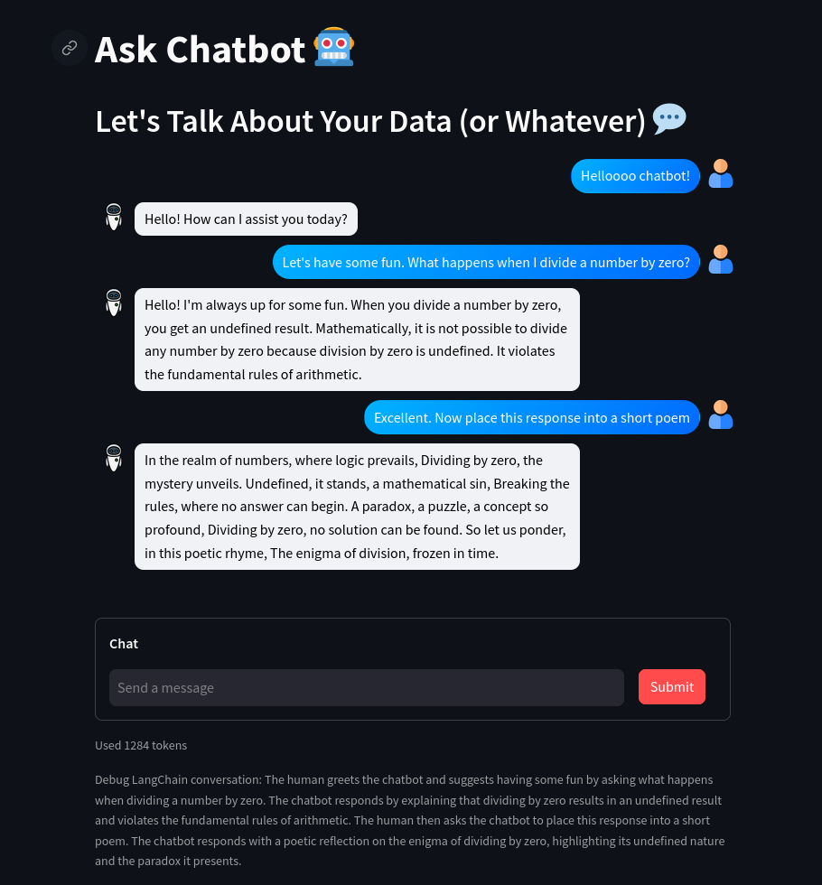

<div align="center">


# Ask Chatbot

Streamlit web app providing a Large Language Model (LLM) chatbot with a custom knowledge base


</div>

## [Live Demo](https://ask-chatbot.streamlit.app/)

- Deployed to Streamlit Community Cloud ☁️
- Conversation LLM chatbot chain only
- For simplicity and privacy, the semantic search of personal or organizational documents to create a custom knowledge base for the LLM is available only as a local deployment feature

## Custom Knowledge Base

- Extend the LLM chatbot with a custom knowledge base
- Include the data you wish to upload to extend the LLM chatbot in the 'data' directory
- Anticipates to load any .txt, .pdf, .csv, .docx, or .xlsx files found in the directory
- Web scraping, see [code](helpers/web_scraping.py) for details
- Data is persisted within a local ChromaDB vector store

## Project Details

- Developed with Python version 3.10
- Streamlit
- LangChain
- OpenAI
- ChromaDB
- BeautifulSoup

## Getting Started

- Create a .streamlit folder in the 'src' directory and include the contents of the [.streamlit.example](.streamlit.example)

- To initialize a virtual enviroment, navigate to the 'src' directory in the terminal and execute

  ```
  $ python -m venv venv
  ```

- Activate the virtual environment, on MacOS or Linux with

  ```
  $ source venv/bin/activate
  ```

- Install dependencies

  ```
  $ pip install -r requirements.txt
  ```
  Some LangChain packages may have hidden dependencies that require pip installation

- Run the app

  ```
  $ streamlit run app.py
  ```

  Open your browser at http://localhost:8501

- To deactivate the virtual environment

  ```
  $ deactivate
  ```

<div align="center">

|                    LLM Conversation                     |
| :-----------------------------------------------------: |
|  |

</div>
"# LangChain-LLM--Chatbot" 
"# LangChain-LLM--Chatbot" 
